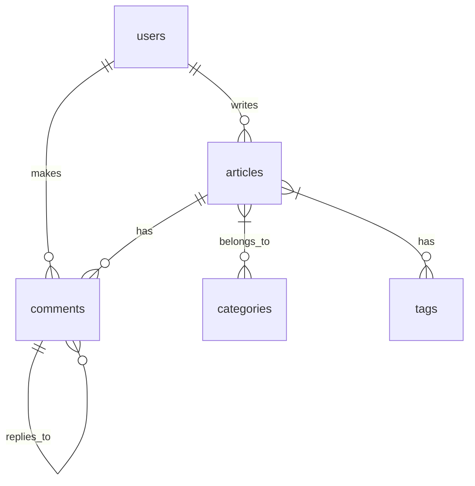

# 数据库设计文档

## 数据库连接信息
```python
host: localhost
user: root
password: tZ_,;qP1?CtV
database: user_db
```

## 表关系设计

### ER 图概述



### 关系说明

1. 用户与文章 (1:N)
   - 一个用户可以发表多篇文章
   - 每篇文章只能有一个作者
   - 关联字段：articles.author_id -> users.id

2. 用户与评论 (1:N)
   - 一个用户可以发表多条评论
   - 每条评论只能有一个作者
   - 关联字段：comments.user_id -> users.id

3. 文章与评论 (1:N)
   - 一篇文章可以有多条评论
   - 每条评论只能属于一篇文章
   - 关联字段：comments.article_id -> articles.id

4. 评论的层级关系 (1:N)
   - 一条评论可以有多个回复
   - 每个回复只能有一个父评论
   - 关联字段：comments.parent_id -> comments.id

5. 文章与分类 (M:N)
   - 一篇文章可以属于多个分类
   - 一个分类可以包含多篇文章
   - 关联表：article_categories
   - 关联字段：
     * article_categories.article_id -> articles.id
     * article_categories.category_id -> categories.id

6. 文章与标签 (M:N)
   - 一篇文章可以有多个标签
   - 一个标签可以关联多篇文章
   - 关联表：article_tags
   - 关联字段：
     * article_tags.article_id -> articles.id
     * article_tags.tag_id -> tags.id

7. 分类的层级关系 (1:N)
   - 一个分类可以有多个子分类
   - 每个分类只能有一个父分类
   - 关联字段：categories.parent_id -> categories.id

## 表结构设计

### articles 表
```sql
CREATE TABLE articles (
    id INT NOT NULL AUTO_INCREMENT PRIMARY KEY,
    title VARCHAR(200) NOT NULL,
    slug VARCHAR(100) NOT NULL UNIQUE,
    content TEXT NOT NULL,
    summary VARCHAR(200),
    meta_title VARCHAR(200),
    meta_description VARCHAR(500),
    keywords VARCHAR(200),
    status VARCHAR(20),
    is_featured TINYINT(1),
    allow_comments TINYINT(1),
    created_at DATETIME,
    updated_at DATETIME,
    published_at DATETIME,
    author_id INT,
    view_count INT,
    comment_count INT,
    like_count INT,
    cover_image VARCHAR(500),
    seo_title VARCHAR(200),
    seo_description VARCHAR(500),
    FOREIGN KEY (author_id) REFERENCES users(id)
);
```

特点：
- 完整的文章内容管理
- SEO 相关字段（meta_title, meta_description, keywords）
- 统计字段（view_count, comment_count, like_count）
- 文章状态和特性控制（status, is_featured, allow_comments）
- 时间管理（created_at, updated_at, published_at）

### users 表
```sql
CREATE TABLE users (
    id INT NOT NULL AUTO_INCREMENT PRIMARY KEY,
    username VARCHAR(50) NOT NULL UNIQUE,
    email VARCHAR(100) NOT NULL UNIQUE,
    full_name VARCHAR(100),
    department VARCHAR(100),
    role VARCHAR(20),
    hashed_password VARCHAR(200) NOT NULL,
    is_active TINYINT(1),
    created_at DATETIME,
    updated_at DATETIME,
    avatar LONGTEXT
);
```

特点：
- 用户认证必要字段（username, email, hashed_password）
- 用户信息扩展（full_name, department, role）
- 状态控制（is_active）
- 头像支持（avatar）

### categories 表
```sql
CREATE TABLE categories (
    id INT NOT NULL AUTO_INCREMENT PRIMARY KEY,
    name VARCHAR(50) UNIQUE,
    slug VARCHAR(50) UNIQUE,
    description TEXT,
    parent_id INT,
    level INT,
    sort_order INT,
    path VARCHAR(100),
    created_at DATETIME DEFAULT CURRENT_TIMESTAMP,
    updated_at DATETIME DEFAULT CURRENT_TIMESTAMP ON UPDATE CURRENT_TIMESTAMP,
    FOREIGN KEY (parent_id) REFERENCES categories(id)
);
```

特点：
- 支持分类层级结构（parent_id, level, path）
- 自动维护时间戳（created_at, updated_at）
- 唯一索引：name, slug
- 排序支持（sort_order）

### tags 表
```sql
CREATE TABLE tags (
    id INT NOT NULL AUTO_INCREMENT PRIMARY KEY,
    name VARCHAR(50) UNIQUE,
    slug VARCHAR(50) UNIQUE,
    description TEXT,
    created_at DATETIME DEFAULT CURRENT_TIMESTAMP,
    updated_at DATETIME DEFAULT CURRENT_TIMESTAMP ON UPDATE CURRENT_TIMESTAMP
);
```

特点：
- 自动维护时间戳（created_at, updated_at）
- 唯一索引：name, slug

### comments 表
```sql
CREATE TABLE comments (
    id INT NOT NULL AUTO_INCREMENT PRIMARY KEY,
    content TEXT NOT NULL,
    article_id INT NOT NULL,
    user_id INT NOT NULL,
    parent_id INT,
    is_approved TINYINT(1),
    is_spam TINYINT(1),
    ip_address VARCHAR(45),
    user_agent VARCHAR(200),
    created_at DATETIME,
    updated_at DATETIME,
    FOREIGN KEY (article_id) REFERENCES articles(id),
    FOREIGN KEY (user_id) REFERENCES users(id),
    FOREIGN KEY (parent_id) REFERENCES comments(id)
);
```

特点：
- 支持评论嵌套（parent_id）
- 评论审核功能（is_approved, is_spam）
- 记录评论者信息（ip_address, user_agent）
- 关联文章和用户

### 关联表

#### article_categories 表
```sql
CREATE TABLE article_categories (
    article_id INT,
    category_id INT,
    FOREIGN KEY (article_id) REFERENCES articles(id),
    FOREIGN KEY (category_id) REFERENCES categories(id)
);
```

用途：实现文章和分类的多对多关系

#### article_tags 表
```sql
CREATE TABLE article_tags (
    article_id INT,
    tag_id INT,
    FOREIGN KEY (article_id) REFERENCES articles(id),
    FOREIGN KEY (tag_id) REFERENCES tags(id)
);
```

用途：实现文章和标签的多对多关系

## 索引设计

### 主键索引
- 所有表都使用自增的 id 作为主键

### 唯一索引
1. users 表
   - username
   - email

2. articles 表
   - slug

3. categories 表
   - name
   - slug

4. tags 表
   - name
   - slug

### 外键索引
1. articles 表
   - author_id

2. comments 表
   - article_id
   - user_id
   - parent_id

3. article_categories 表
   - article_id
   - category_id

4. article_tags 表
   - article_id
   - tag_id

### 普通索引
1. categories 表
   - parent_id
   - path（用于树形结构查询）

2. articles 表
   - created_at（用于排序）
   - status（用于筛选）

## 数据完整性约束

### 实体完整性
- 所有表都使用主键约束
- 使用自增 ID 避免重复

### 参照完整性
- 使用外键约束确保关联数据的一致性
- 设置级联删除或更新规则

### 域完整性
- 使用适当的数据类型
- 添加非空约束
- 设置默认值

## 数据库管理技巧

1. 查看所有表
```sql
SHOW TABLES;
```

2. 查看表结构
```sql
DESCRIBE table_name;
-- 或者
SHOW COLUMNS FROM table_name;
```

3. 查看表的详细信息
```sql
SELECT COLUMN_NAME, DATA_TYPE, IS_NULLABLE, COLUMN_DEFAULT, EXTRA 
FROM INFORMATION_SCHEMA.COLUMNS 
WHERE TABLE_NAME = 'table_name';
```

4. 修改列定义
```sql
-- 示例：修改时间戳列的默认值和自动更新
ALTER TABLE table_name
    MODIFY created_at DATETIME DEFAULT CURRENT_TIMESTAMP,
    MODIFY updated_at DATETIME DEFAULT CURRENT_TIMESTAMP ON UPDATE CURRENT_TIMESTAMP;
```

## 最佳实践

1. 时间戳字段
- 使用 `DATETIME` 类型而不是 `TIMESTAMP`
- `created_at` 设置默认值为 `CURRENT_TIMESTAMP`
- `updated_at` 设置默认值为 `CURRENT_TIMESTAMP` 并添加 `ON UPDATE CURRENT_TIMESTAMP`

2. 索引使用
- 主键使用自增的 `INT`
- 经常用于查询的字段添加索引
- 唯一字段（如 name, slug）添加唯一索引

3. 外键关系
- 使用外键确保数据完整性
- 为外键字段创建索引提高查询性能

4. 字段命名
- 使用下划线命名法
- 字段名清晰表达其用途
- 保持命名风格统一

## 注意事项

1. 时间戳
- 确保所有表的时间戳字段配置一致
- 在创建新表时记得添加时间戳字段
- 注意时区设置对时间戳的影响

2. 数据完整性
- 适当使用外键约束
- 为重要字段添加非空约束
- 使用唯一索引防止重复数据

3. 性能优化
- 合理使用索引
- 避免过度使用外键
- 定期维护和优化数据库